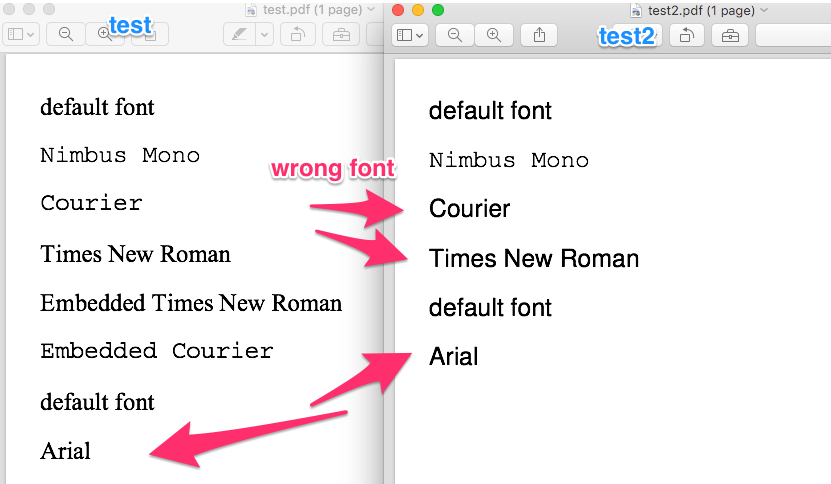

Why does `test2.html` not render "Nimbus Mono L" when "Courier" is used, or "Nimbus
Roman No9 L" when "Times New Roman" is used?

This is not the behavior in wkhtmltopdf .9.9



```sh
# build docker images
./d build

# correctly generates output/test.pdf only when the @font-face for Arial/Times New Roman are included
./d test

# incorrectly generates output/test2.pdf
./d test2

# correctly generates output/test2.pdf using wkhtmltopdf .9.9
./d test2-v9
```
